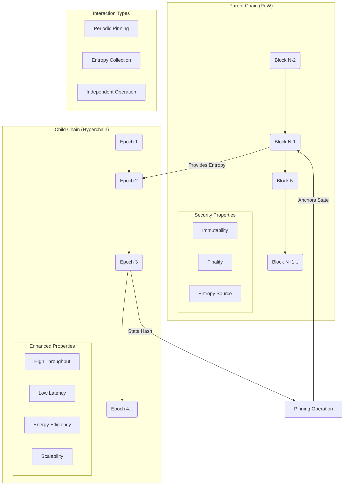
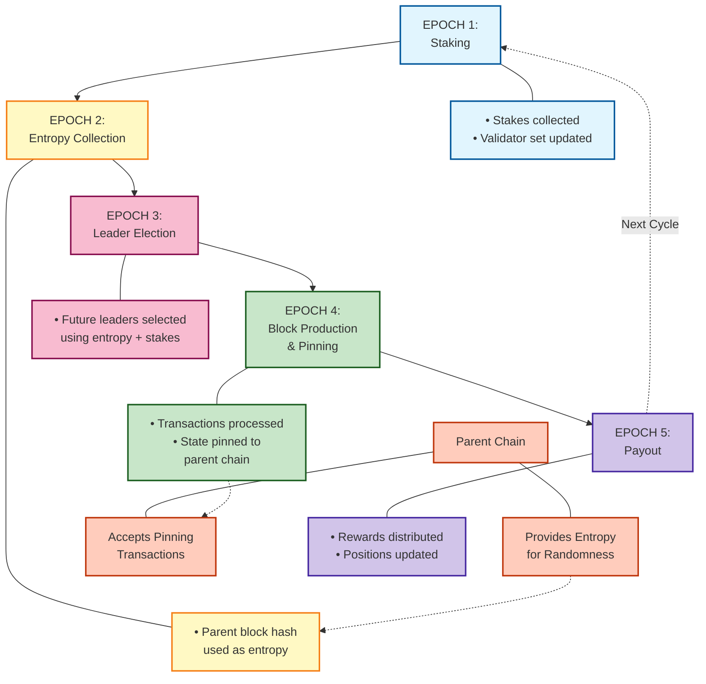
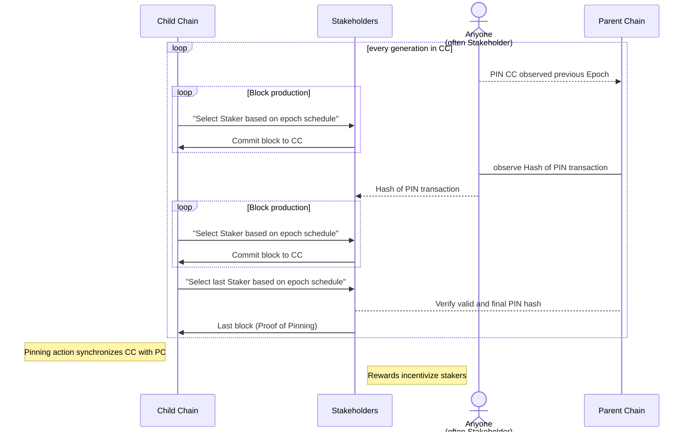

# **Hyperchains: Bridging Security and Scalability Through Periodic Synchronization**

Version 2.0 \- Revision 03\_25

by: Erik Steinman, Thomas Arts, Hans Svensson, Måns Klerker, Justin Mitchell, Susan Ploetz

For for detailed technical specifications, please refer to the [Technical Details section](Periodically-Syncing-HyperChains.md\#in-depth-description-of-proposed-solution) of the original whitepaper.

## **Introduction**

Blockchain technology has revolutionized digital trust systems but faces critical limitations as adoption grows. Bitcoin's Proof-of-Work (PoW)[^1] established trustless distributed ledgers but struggles with energy consumption and scalability. Proof-of-Stake (PoS) alternatives improve efficiency but introduce new vulnerabilities, particularly the "Nothing at Stake"[^2] dilemma where validators can support multiple forks without cost.

Hyperchains address these challenges by combining the security of established PoW networks with the efficiency of PoS systems. This paper examines how the periodically syncing Hyperchains architecture resolves fundamental blockchain challenges through innovative cross-chain synchronization mechanisms.

## **Background and Motivation**

### **The Blockchain Trilemma**

Traditional blockchains face an inherent trilemma[^3] between security, scalability, and decentralization. Proof-of-Work chains like Bitcoin excel in security through their robust consensus mechanism, but they process transactions slowly and consume enormous energy resources. Proof-of-Stake chains offer better efficiency and scalability but introduce new security challenges related to stake distribution and validator incentives.

This trilemma has historically forced blockchain architects to prioritize one or two properties at the expense of others. Hyperchains aim to transcend this limitation by creating a system that inherits security from established PoW networks while enabling efficient transaction processing through an optimized PoS mechanism implemented on æternity blockchain architecture.

### **Fundamental Challenges in Hybrid Blockchain Systems**

Previous attempts to combine PoW and PoS through cross-chain mechanisms revealed significant technical challenges:

**Security and Randomness**: A secure, unbiasable source of randomness is critical for leader selection in PoS systems. Parent chain block hashes provide this randomness but require careful implementation to prevent manipulation. Using finalized parent chain blocks addresses this vulnerability.

**Chain Synchronization**: Early hybrid implementations attempting continuous "lockstep" synchronization proved brittle—parent chain delays would halt child chain progression, demanding a more flexible synchronization model.

**Validator Coordination**: The "Nothing at Stake" problem required mitigation without the prohibitive costs of continuous cross-chain commitments. Token-locking and formal registration processes created excessive operational overhead.

**Cross-Chain Complexity**: Managing different chain speeds, handling reorganizations, and balancing coordination costs with security benefits all required innovative solutions beyond simple chain linking. The realization that global time assumptions don't exist in decentralized systems drove the move toward periodic rather than continuous synchronization.

## **The Evolution of Hyperchains**

The Hyperchains concept has undergone significant transformation since its inception in 2016\. When Yanislav Malahov[^4] first proposed the idea, he envisioned leveraging established blockchain security to create efficient, scalable systems without duplicating mining efforts—effectively "recycling the power of blockchains."

The original concept employed "cross-timestamping," where smaller chains would anchor their state to established networks like Bitcoin. Early implementation attempts revealed fundamental challenges: proving an event happened "before" a specific time proved significantly harder than proving it happened "after" another event—an insight that would later shape the periodic synchronization model.

Between 2017[^5] and 2020[^6], as æternity matured with innovations like Bitcoin-NG consensus and the FATE virtual machine, these technologies created a foundation for addressing cross-chain synchronization challenges. The 2020 whitepaper "Æternity Hyperchains: Recycling Power of Blockchains"[^7] proposed a comprehensive framework with validators posting commitments to the parent chain and sophisticated leader election mechanisms.

However, implementation revealed critical flaws. The "lockstep" synchronization approach proved brittle—when the parent chain slowed, the entire child chain halted. Additionally, frequent validator commitments generated unsustainable transaction costs. By 2023, the team fundamentally reconceptualized their approach, eliminating the assumption of global time between chains and implementing an epoch-based system with three crucial innovations:

1. Decoupling real-time dependencies through predefined epochs  
2. Implementing future leader election using well-finalized historical blocks  
3. Replacing continuous commitments with strategic pinning operations

Real-world testing in 2024 led to further refinements, including the addition of a fifth epoch—the Entropy Epoch—creating a buffer ensuring continuous operation during parent chain delays. The pinning mechanism evolved with cumulative rewards and third-party participation to address practical operational scenarios.

This development journey revealed critical insights: theoretical security must balance with operational reality; periodic verification provides sufficient security without continuous interaction; and economic incentives drive security behaviors more effectively than rigid protocols. The architecture that emerged combines æternity's advanced technical features with innovative cross-chain security mechanisms, creating a practical framework for enterprise blockchain applications.

## **Key Innovations**

The Periodically Syncing Hyperchains architecture introduces four groundbreaking innovations:

**Future Leader Election** enables pre-emptive block producer selection using secure randomness from finalized parent chain blocks, establishing a predictable yet unpredictable leadership schedule that maintains security while enabling rapid transaction finalization.

**Five-Epoch Staking Cycle** separates stake collection, entropy gathering, leader selection, block production, and reward distribution into distinct phases, providing clear boundaries for state transitions.

**Strategic Pinning** enables efficient state verification through periodic proof posting rather than continuous on-chain commitments, significantly reducing operational costs while maintaining security guarantees.

**Flexible Chain Speed** allows independent operation rates between parent and child chains, eliminating the brittleness of earlier approaches while maintaining security guarantees.

These innovations represent the culmination of years of research tackling blockchain's fundamental trilemma and the specific challenges of hybrid architectures.

## **Hyperchains Architecture**

### **Fundamental Concept**

A Hyperchain consists of two distinct but interconnected blockchain systems: the Parent Chain and the Child Chain. The Parent Chain (also called the Pinning Chain) is an established, secure blockchain—typically running Proof-of-Work consensus—that provides security anchoring and randomness. This chain continues to operate according to its own protocol, unaware of the child chain's existence. The implementation allows for various parent chains including Bitcoin, Litecoin, Dogecoin, or aeternity itself, providing flexibility in security model selection.

**Figure 1:** Parent-Child Chain Relationship in Hyperchains Architecture - Showing the interaction between the two chains including security properties, enhanced properties, and interaction types

The Child Chain (Hyper Chain) is built on Aeternity's blockchain architecture, inheriting its advanced technical capabilities while implementing a specialized Proof-of-Stake consensus mechanism. The child chain leverages the parent chain's security while offering faster transaction processing and finality. By building on aeternity's foundation, Hyperchains benefit from established features including state channels for off-chain scaling, the efficient FATE virtual machine for smart contract execution, the aeternity naming system (AENS), and oracle capabilities—all while adding the security benefits of parent chain anchoring.

This architecture creates a system where the child chain can operate independently most of the time while periodically "checking in" with the parent chain for security anchoring and randomness collection. This periodic rather than continuous synchronization is a key innovation that emerged from practical implementation experience, resolving the brittleness of earlier approaches that required constant parent-child chain interaction.

### **The Five-Epoch Staking Cycle**

**Figure 2:** The Five-Epoch Staking Cycle - Illustrating the complete cycle with color-coded epochs and their relationships to the parent chain

The Hyperchain operates through a structured five-epoch cycle that coordinates all system activities. This structure, refined through multiple implementation iterations, provides clear boundaries for critical operations while maintaining operational flexibility.

The first phase is the Staking Epoch, during which participants register and adjust their stakes, providing the economic security for the network. This establishes the validator set that will be eligible for future leader selection. During this epoch, the system collects the staking power distribution that will influence future leader elections, creating a clear snapshot of network participation.

Next comes the Entropy Epoch, added in the 2024 implementation based on real-world testing that revealed the need for dedicated randomness collection. The system collects random values from the parent chain, specifically block hashes from finalized parent chain blocks. This dedicated epoch ensures reliable access to unbiasable randomness even when parent chain block production experiences temporary delays.

In the Leader Election Epoch, the system uses the collected entropy and staking data to deterministically select validators who will serve as block producers in subsequent epochs. This pre-emptive selection is a key innovation enabling operational continuity. The election process creates a complete schedule of leaders for the upcoming block production epoch, providing predictability while maintaining security through unbiasable selection.

During the Block Production & Pinning Epoch, selected leaders create blocks, process transactions, and anchor the child chain state to the parent chain through strategic pinning operations. Leaders follow the predetermined schedule, creating blocks and processing transactions according to aeternity's efficient transaction model. At designated intervals, typically at epoch boundaries, the system anchors its state to the parent chain through pinning transactions.

Finally, the Payout Epoch completes the cycle as rewards are distributed to validators based on their contributions, and stake positions are updated accordingly. This creates a clear accounting of participation and rewards, setting the stage for the next cycle to begin.

Each epoch serves a specific purpose in maintaining the chain's security and operational efficiency. The addition of a dedicated entropy epoch enhances the system's randomness generation, crucial for fair and unpredictable leader selection. The full five-epoch structure creates a comprehensive system that balances security, performance, and operational continuity.

### **System Participants**

The Hyperchain ecosystem involves several interconnected participant roles that maintain network security and efficiency. Chain Initiators configure and launch Hyperchains, establishing fundamental parameters and deploying required smart contracts. Validators operate nodes that process transactions and potentially produce blocks when selected as leaders, while Delegators contribute stake without running nodes themselves. Selected validators become Block Producers (Leaders) during specific periods based on the election process, and typically the producer of an epoch's final block serves as a Pinner, anchoring the child chain state to the parent chain. This interconnected system creates balanced responsibilities and incentives that maintain operational integrity.

### **Transcending the Blockchain Trilemma**

Hyperchains address the blockchain trilemma through a sophisticated architecture that combines the strengths of different consensus models while mitigating their weaknesses.

By anchoring critical state information to a secure parent chain, the child chain inherits robust security guarantees without duplicating energy-intensive mining operations. This security inheritance is achieved through strategic pinning operations that create cryptographic links between the child and parent chains, leveraging established PoW security for the PoS child chain.

The child chain operates at its own pace, processing transactions rapidly through an efficient Proof-of-Stake mechanism with predetermined leader schedules. Built on aeternity's high-performance blockchain technology, the child chain achieves throughput and finality times that far exceed traditional PoW systems, enabling practical applications that require rapid transaction processing.

The leader election process uses unbiasable randomness from the parent chain combined with stake-weighted selection, ensuring fair participation while preventing centralization. This mechanism creates unpredictable yet verifiable leader selection that cannot be manipulated by individual participants, maintaining decentralization despite the efficiencies of the PoS model.

This balanced approach creates a system that achieves previously impossible combinations of security, efficiency, and decentralization. By carefully integrating the strengths of aeternity's blockchain technology with strategic parent chain anchoring, Hyperchains solve fundamental challenges that have limited blockchain adoption for performance-critical applications.

## **Technical Components**

### **Future Leader Election**

The future leader election process represents a fundamental innovation in the Hyperchain architecture. Rather than selecting leaders in real-time—which creates dependencies on immediate parent chain progression—the system selects leaders in advance using verifiable randomness derived from finalized parent chain history. This approach emerged directly from implementation experience with earlier Hyperchain versions that suffered from operational disruptions when parent chains experienced delays.

```mermaid
sequenceDiagram
  participant S as Staker (an account address)
  participant V as Validator (a node)
  participant CC as Child Chain
  participant PC as Parent Chain
  rect rgb(10,60,10)
    note over CC: Staking epoch 1
    note over PC: PE(1)
      loop for each stakeholder
        S->>CC: Stake for Block production epoch 4
    end
    Note left of CC: Stakeholders influence future CC epoch 4 election through staking
  end
  rect rgb(20,80,20)
    note over CC: Entropy epoch 2
    note over PC: PE(2)
    S->>CC: Stake for Block production epoch 5, next cycle
    Note left of CC: (In the next cycle stakeholders influence future CC epoch 5 election through staking)
  end
  rect rgb(30,100,30)
    note over CC: Election epoch 3
    note over PC: PE(3)
    Note over PC: Finality Zone
    S->>CC: Stake for Block production epoch 6, next next cycle
    PC->>CC: Seed for Leader Election
 end
 rect rgb(40,120,40)
  note over CC: Block production epoch 4
  note over PC: PE(4)
  V->>CC: New leaders from epoch 1 stake
  loop for each validator
    V->>CC: Validate block
    S->>CC: Stake for Block production epoch 7, next next next cycle
    note over CC: Transactions
  end
 end
 rect rgb(50,140,50)
  note over CC: Payout epoch 5
  note over PC: PE(5)
  V->>CC: New leaders from epoch 2 stake
  CC->>S: Payout of rewards
  S->>CC: Stake for Block production epoch 8, next next next next cycle
end
```

**Figure 3:** The Five-Epoch Staking Cycle showing interactions between stakeholders, validators, child chain, and parent chain across all five epochs.

The core principle behind future leader election is predictable unpredictability—creating a leader selection process that is deterministic enough to plan operations around but unpredictable enough to prevent manipulation. This balance is achieved by combining entropy from the parent chain with stake distribution from the child chain.

The system derives randomness from historical parent chain blocks that have achieved finality. By looking sufficiently far back in the parent chain's history—beyond the practical reorganization depth—the system ensures that powerful miners cannot manipulate the entropy source even. This approach addresses a fundamental vulnerability in cross-chain systems: the potential for parent chain miners to influence child chain leadership if recent blocks are used for randomness.

Complementing this external randomness, the system incorporates stake distribution data from previous child chain epochs. This creates an economically aligned selection mechanism where leadership opportunities are proportional to network investment. Importantly, the stake distribution used for selection is recorded at a fixed point in the past, preventing participants from strategically adjusting their stakes after seeing the entropy that will determine selection.

The combination of these two elements—external randomness and historical stake distribution—creates a selection process that is both fair and secure. At designated points in the child chain's operation, the system executes the leader selection algorithm, creating a complete schedule of leaders for upcoming blocks. This preemptive selection allows the child chain to continue operation even during temporary parent chain disruptions, as leadership is determined well in advance.

The timing of these elements is carefully coordinated through the epoch structure. Leader election for a particular epoch uses data from multiple epochs in the past, ensuring that all inputs to the selection process are firmly established and immutable by the time selected leaders begin block production. This forward-looking approach enables validators to prepare for their leadership responsibilities while maintaining the security guarantees necessary for trustless operation.

This election mechanism represents a significant advancement over earlier approaches that required continuous parent chain monitoring. By decoupling real-time operation from leader selection, the system achieves both security and operational resilience—qualities that had previously seemed mutually exclusive in cross-chain architectures.

### **Periodic Synchronization Framework**

The child chain maintains loose synchronization with the parent chain through the pinning mechanism, allowing for independent operation when needed while creating security anchors at regular intervals. This approach enables flexible chain speed adjustments through a structured governance process.

The system implements epoch alignment where child chain epochs are calibrated to align with parent chain timing characteristics, establishing a semi-lock-step movement through coordinated epochs. Dynamic adjustment mechanisms recalibrate when timing deviations occur, primarily through adjustments to the Child Epoch Length (CEL) parameter.

While individual block times on PoW chains are variable, the system leverages the statistical stability of block production over longer periods to establish reliable synchronization. Chain speed management occurs through a structured governance process where stakeholders can submit proposals for CEL adjustment as special transactions, which undergo validation before proceeding to an automated voting process.

This periodic synchronization approach represents a significant advancement over earlier attempts at continuous cross-chain coupling. By eliminating real-time dependencies while maintaining strategic synchronization points, the system achieves both security and operational flexibility.

### **Pinning Mechanism**

The pinning mechanism anchors the child chain's state to the parent chain at strategic intervals, creating an immutable cross-chain record that leverages parent chain security. This approach has evolved significantly from initial concepts that required continuous commitments from all validators in the 2020 whitepaper implementation.

At its core, pinning addresses a fundamental security concern in Proof-of-Stake systems: the possibility of long-term history rewrite attacks. In these attacks, adversaries might acquire old addresses with substantial staking power to create an alternative chain from an early state. By periodically anchoring critical child chain state information to the more secure parent chain, the system creates verifiable checkpoints that prevent such manipulation even if stake ownership changes over time.

The evolution of the pinning mechanism reflects a key insight gained through implementation experience: security anchoring does not require continuous interaction to be effective against long-term attacks. Since history rewrite attacks necessarily unfold over extended periods, periodic anchoring provides sufficient protection while dramatically reducing operational costs compared to continuous approaches.

The pinning process operates as an incentivized action within the Hyperchain ecosystem. At designated intervals, typically at epoch boundaries, a participant (referred to as the Pinner) creates a transaction on the parent chain that contains cryptographic proof of the child chain's current state. This proof includes references to block identifiers, heights, and epoch information from the child chain—creating a verifiable link between the two chains.

**Figure 4:** Pinning process flow showing how stakeholders, external users, and chains interact during the pinning operation.

Once this anchoring transaction achieves finality on the parent chain, the Pinner submits proof of the anchoring back to the child chain. This creates a circular verification path where the child chain can confirm its state has been properly anchored while parent chain observers can verify the authenticity of anchored information. This two-way verification is crucial for maintaining trust in the cross-chain relationship without requiring continuous monitoring of both chains.

To ensure consistent pinning operations, the system implements economic incentives that align participant behavior with security requirements. Each successful pinning action earns a specific reward, but if pinning actions are missed, the allocated reward carries over to subsequent opportunities. This creates an increasing incentive for pinning as missed actions accumulate, ensuring that temporary disruptions do not compromise long-term security.

The system also supports third-party pinning, allowing any interested party to execute the pinning transaction on the parent chain. This flexibility addresses practical operational scenarios where designated participants might be temporarily unavailable or face resource constraints. By opening pinning participation beyond primary validators, the system creates redundancy that enhances overall security while maintaining proper reward attribution.

This flexible, economically incentivized approach to cross-chain anchoring represents a significant advancement over earlier designs. It achieves robust security guarantees while minimizing operational overhead, creating a sustainable model for long-term cross-chain operation that balances theoretical security with practical implementation considerations.

### **Economic Incentives**

The Hyperchain architecture incorporates a carefully designed economic incentive structure to ensure reliable operation and active participation. The system offers two primary reward categories: Block Production Rewards for validators who successfully produce blocks during their designated slots, and Pinning Rewards for participants who anchor the child chain state to the parent chain.

The pinning reward system includes an innovative approach to cumulative rewards. By rolling over missed pinning rewards to subsequent opportunities, the system creates an increasing economic incentive that ensures eventual pinning without requiring constant transactions. A rational validator will perform pinning when it becomes cost-efficient, while security-minded participants might pin more frequently than strictly economical.

This incentive model extends to support third-party pinning, allowing stakeholders to contribute to chain security even if they aren't validators themselves. This broadens participation while maintaining security through appropriate reward distribution, creating additional economic opportunities within the ecosystem.

By aligning economic incentives with security-enhancing behaviors, the Hyperchain creates a self-sustaining system that maintains robust security guarantees while minimizing operational costs.

## **Implementation and Validation**

### **Smart Contract Architecture**

The consensus and operational mechanisms of the child chain are implemented through a system of smart contracts deployed during genesis. The foundational contract is the staking contract, which tracks validator stakes and manages the five-phase staking cycle.

This contract maintains critical protocol functions including tracking validator stakes and positions at each height, managing state transitions between epochs, processing pinning rewards and distributions, and handling epoch length adjustments through validator voting.

Additional contracts can be deployed based on specific requirements, such as delegation contracts enabling stake delegation to validators. All contract interactions occur through visible on-chain calls, ensuring transparency and verifiability of system operations.

Epoch length adjustments follow a structured governance process through this contract system. The last leader of a production epoch can propose changes through specialized contract calls, with proposals voted on in the subsequent epoch and changes taking effect in following production epochs if approved.

### **Child Chain Implementation**

The Hyperchain implementation requires a specialized blockchain architecture that diverges from traditional Proof of Stake systems. While the child chain builds upon established Aeternity node architecture, it introduces crucial modifications to support Hyperchain-specific operations.

These modifications include sophisticated pinning proof verification mechanisms, comprehensive epoch awareness throughout state transitions, precise tracking of stake distributions and leader schedules, continuous monitoring of parent chain block finality, and enhanced fork choice rules that consider both traditional consensus factors and pinning status.

This implementation demonstrates the architecture's practical application while establishing a production-ready reference for future deployments. The system's modular design ensures that the fundamental benefits of the Hyperchains approach—security, efficiency, and scalability—remain consistent across different implementations.

### **Reference Implementation**

While the Hyperchains architecture is designed to be blockchain-agnostic, the initial implementation utilizes the æternity blockchain as both parent chain and technological foundation. This choice leverages æternity's established proof-of-work security while implementing specialized proof-of-stake mechanisms for the child chain.

This reference implementation showcases how the core architectural elements work together in practice while maintaining flexibility for future implementations to use different parent chains based on specific security and operational requirements.

## **Applications and Use Cases**

The Periodically Syncing Hyperchains architecture enables new applications across multiple industries by providing a unique combination of security, scalability, and economic efficiency. By leveraging aeternity's robust technical foundation while adding enhanced security through parent chain anchoring, Hyperchains create opportunities for blockchain deployment in environments with demanding performance and security requirements.

### **Financial Services**

Financial institutions can deploy private Hyperchains for internal settlement systems, leveraging public blockchains for security while maintaining control over transaction validation. This combination addresses the traditional struggle between transaction throughput and security guarantees.

Hyperchains enable high-frequency trading settlement through rapid block production while anchoring finality to established public blockchains. This supports cross-border payment networks with regional compliance and global settlement through parent chain anchoring. Tokenized asset exchanges benefit from aeternity's efficient state handling plus enhanced security for high-value transactions. Compliance systems leverage the dual nature of Hyperchains—maintaining detailed transaction records on the child chain with immutable audit points through parent chain anchoring.

Financial institutions value operating private validation networks with public blockchain security benefits, controlling access and transaction validation while preventing history rewrites through external verification.

### **Supply Chain Management**

Supply chain ecosystems benefit from Hyperchains' efficient transaction processing and immutable record anchoring. This balance makes it ideal for complex supply chains spanning multiple organizations with varying trust requirements.

Real-time inventory tracking is facilitated through efficient child chain structures and predetermined leader schedules. Provenance verification becomes more robust with periodic anchoring to public blockchains, creating irrefutable product history records. Multi-party coordination leverages smart contract capabilities with enhanced security, executing complex processes efficiently while maintaining tamper-proof records. Regulatory compliance is simplified through cryptographically verifiable timestamps, easing verification for auditors and regulators.

Supply chains with participants of different technical expertise benefit from simple verification mechanisms through parent chain references, enabling even non-blockchain specialists to verify critical transaction history.

### **Healthcare and Data Management**

Industries with strict data retention requirements, such as healthcare, can utilize Hyperchains for secure data management while maintaining regulatory compliance. The periodic pinning mechanism creates immutable proof points while the child chain maintains the flexibility needed for sensitive data management scenarios.

Patient record management systems built on Hyperchains can maintain patient privacy on the child chain while creating verifiable timestamps of record state through parent chain anchoring. Clinical trial data validation becomes more robust when trial results are recorded on Hyperchains, providing both the efficiency needed for large datasets and the security required for regulatory approval through parent chain verification. Cross-institutional data sharing benefits from aeternity's advanced smart contract capabilities combined with Hyperchains' security model, enabling controlled access to sensitive information while maintaining cryptographic proof of data integrity. Regulatory compliance verification is simplified through periodic parent chain anchoring, which provides immutable evidence of data integrity that can be verified independently by regulators.

Healthcare organizations particularly value the combination of data privacy controls possible with private child chains and the immutable verification points created through parent chain anchoring, addressing both confidentiality and integrity requirements.

### **Identity and Governance**

Self-sovereign identity systems, digital voting platforms, decentralized autonomous organizations, and public sector administrative systems can all leverage Hyperchains architecture to create secure operational frameworks with rapid finality and verifiable outcomes.

Identity systems benefit from aeternity's naming system combined with Hyperchains' security model, enabling efficient identity verification while preventing unauthorized modifications through periodic parent chain verification. Digital voting platforms can achieve both the high throughput needed for large-scale elections and the security required for vote integrity through parent chain anchoring of election results. Decentralized autonomous organizations can operate efficiently on the child chain while securing critical governance decisions through parent chain verification. Public sector administrative systems can maintain both the performance needed for day-to-day operations and the long-term record integrity required for government functions through strategic parent chain anchoring of administrative state.

## **Future Directions and Conclusion**

### **Development Opportunities**

The Hyperchains architecture is designed to be highly adaptable and customizable, with several potential development paths. As an open-source project, its evolution will be driven by community contributions and specialized implementations for specific use cases.

To support adoption, a web application has been developed that helps users initiate a Hyperchain, set up validators, and delegate stake. This tool simplifies the deployment process and reduces the technical barriers to entry. Additionally, bridge functionality to aeternity and potentially other Hyperchains enables cross-chain value and information exchange.

The modular design of Hyperchains creates opportunities for enhancement in several areas. Privacy mechanisms could be implemented through zero-knowledge proofs while maintaining security anchoring. Governance capabilities could be expanded to create more responsive parameter adjustment and protocol upgrade processes. These potential enhancements highlight the composable nature of the Hyperchains architecture, which can be adapted to diverse requirements without sacrificing its core security model.

### **Broader Implications**

Hyperchains represent a significant advancement in blockchain architecture, addressing fundamental limitations in existing systems through lessons learned from implementation experience. By combining established proof-of-work security with efficient proof-of-stake transaction processing, they enable applications requiring both throughput and security—previously impossible in single-chain systems.

The periodic synchronization approach significantly reduces environmental impact by leveraging existing proof-of-work security rather than duplicating mining operations. Economically, minimal  

---

[^1]:  Nakamoto, S. (2008). Bitcoin: A Peer-to-Peer Electronic Cash System. Retrieved from [https://bitcoin.org/bitcoin.pdf](https://bitcoin.org/bitcoin.pdf)

[^2]:  Sharma, A. (2018) Understanding proof of stake through its flaws. part 2 — ‘nothing’s at stake’

[^3]:  Buterin, V. (2021). Endgame. Retrieved from [https://vitalik.ca/general/2021/12/06/endgame.html](https://vitalik.ca/general/2021/12/06/endgame.html)

[^4]:  Malahov, Y. (2016)Hyperchains: Secure, Cheap and Scalable Technology for Everyone. Retrieved from: https://yanislav.medium.com/hyperchains-secure-cheap-scalable-blockchain-technology-for-everyone-3ddec96a4152

[^5]:  Æternity whitepaper (2017). Retrieved from: https://github.com/aeternity/whitepaper

[^6]:  Updated Æternity whitepaper (2020). Retrieved from: https://github.com/keypair/white-paper/blob/master/aeternity-whitepaper.pdf

[^7]:  Urisaz, Radoslaw et all.(2020) Æternity Hyperchains, [https://github.com/aeternity/hyperchains-whitepaper/releases/download/1.0.0/whitepaper.pdf](https://github.com/aeternity/hyperchains-whitepaper/releases/download/1.0.0/whitepaper.pdf)
