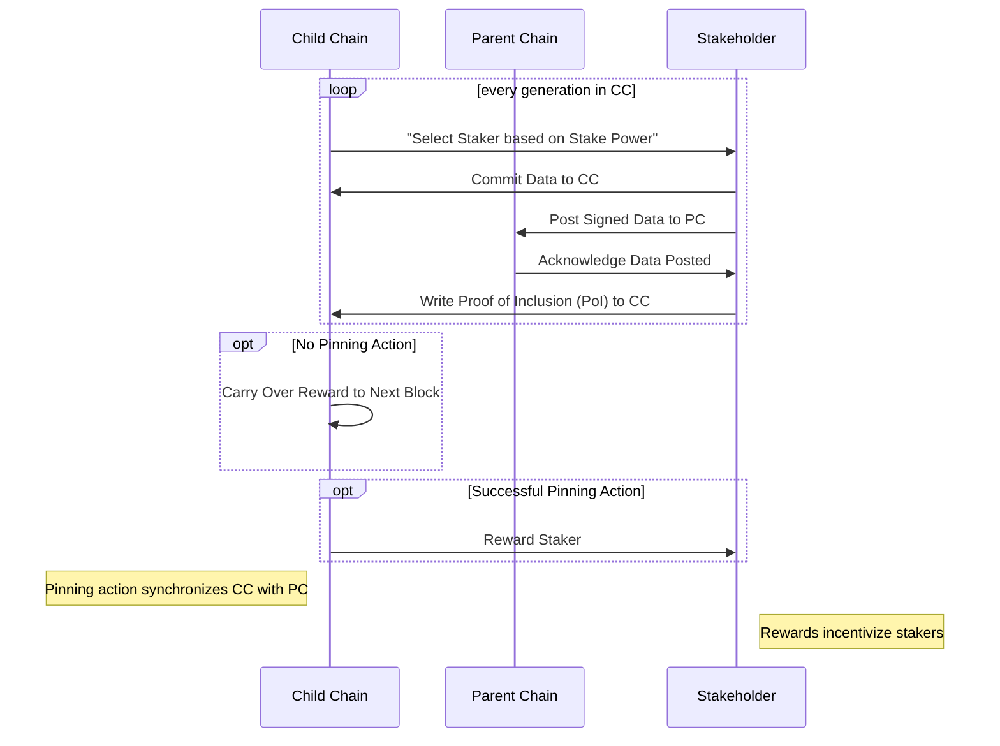
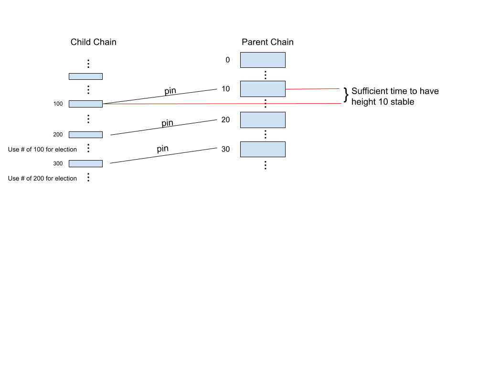
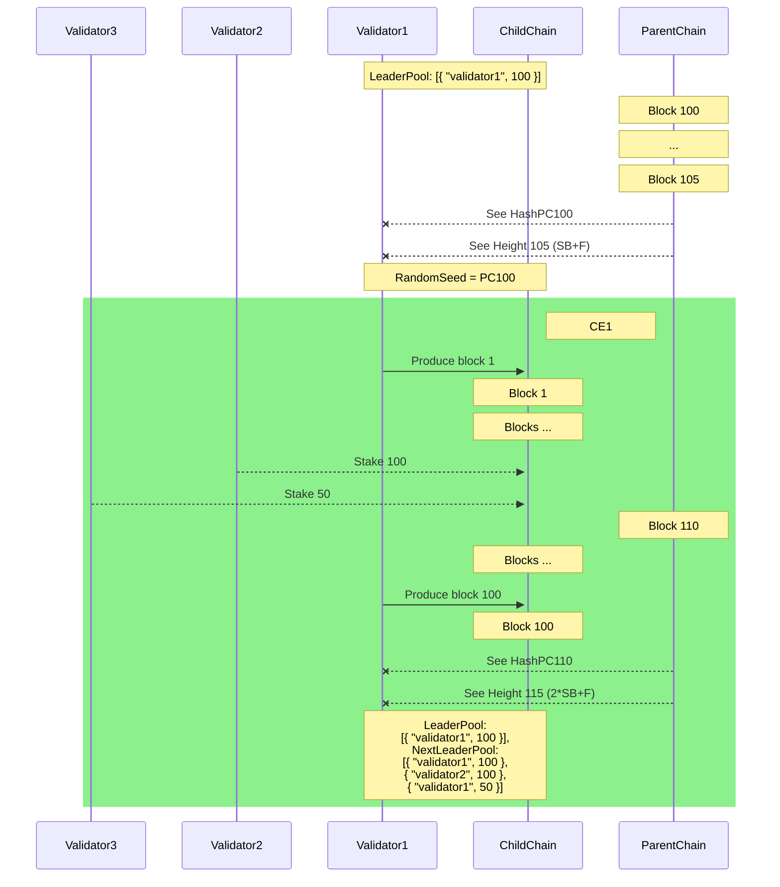
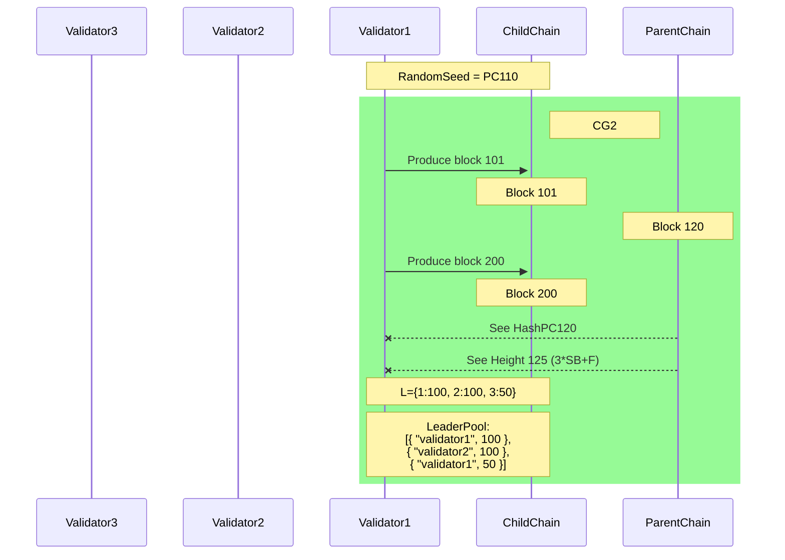
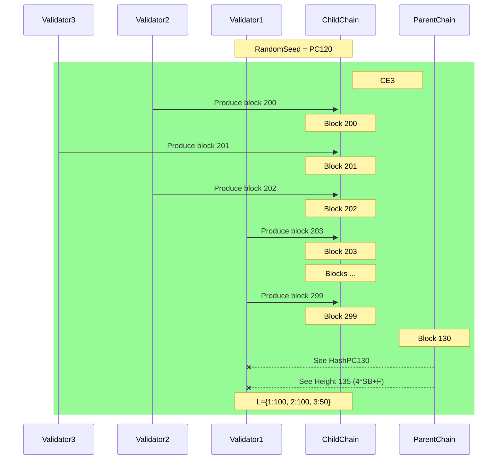

# Periodically Syncing HyperChains
Yanislav Malahov, Erik Stenman, and the Aeternity team
December 2023


## Abstract
Building upon the initial concept of Hyperchains, this paper addresses key challenges in blockchain consensus mechanisms. The proposed solutions are designed to enhance blockchain networks' efficiency, security, and scalability, offering a comprehensive approach to overcoming existing limitations. This paper focuses on reducing the operational dependencies between child and parent chains in the Hyperchain architecture. We propose innovative methods to minimize the need for stakers to post to the parent chain, streamlining the process and reducing associated costs. This approach aims to alleviate the inefficiencies that arise from excessive interactions between the child and parent chains.
Addressing the risk of complete history rewrite attacks is another crucial aspect of our work. We introduce strategies to mitigate this risk, ensuring the integrity and continuity of the blockchain's historical records through pinning. Additionally, the paper provides solutions for handling situations where parent chains operate at varying speeds.
A noteworthy advancement presented in this paper is the pre-emptive leader election mechanism for the child chain. This innovation allows for more rapid finalization on the child chain, significantly increasing the speed and efficiency of transaction processing and consensus achievement. By enabling leader elections in advance, the system ensures swift and reliable finality, which is vital for the smooth operation of blockchain applications.


<!--  # Regenerate this -->

# Table of Contents
Abstract	1
Table of Contents	2
Introduction	3
The history of HyperChains	4
2017 Whitepaper: Laying the Groundwork for æternity's Blockchain Innovation	5
2020 Whitepaper: Advanced Developments in æternity Blockchain	6
HyperChains evolution	6
Periodically Syncing HyperChains	8
Problem Statement	9
Overview of Proposed Solution	10
Future Leader Election	10
Periodic Syncing	12
Pinning	13
Child Chain	14
Methodology	16
Simulation	16
Step 1: Simulating Chain Speed Variability	16
Step 2: Testing with Non-Productive Stakers	16
Step 3: Evaluating the Use of Micro-Blocks	16
Step 4: Assessing Resistance to Long-Term Attacks	17
Review	17
In Depth Description of Proposed Solution	18
Technical Details	18
CC design	19
Open questions:	19
Benefits and Advantages	20
Challenges and Limitations	20
Conclusion	20
References	20

# Introduction
By Satoshi Nakamoto's introduction of Bitcoin in 2008 [11], the inception of blockchain technology marked a shift in digital transactions, establishing a decentralized framework for secure and transparent exchanges. The Proof-of-Work (PoW) consensus mechanism was central to this innovation, a groundbreaking approach that enabled a trustless and distributed ledger. PoW operates on a simple yet robust principle: it grants the right to add new blocks to the chain to those who expend computational energy to solve complex cryptographic puzzles. This method ensured security against fraudulent activities and laid the groundwork for the subsequent development of blockchain technology.
However, the limitations of PoW became increasingly apparent as the usage increased. The mechanism's intensive energy consumption was the most critical, which raised significant scalability and environmental sustainability concerns. Studies and reports began highlighting the enormous energy requirements of PoW blockchains, particularly Bitcoin, and their consequent carbon footprint [9]. These challenges spurred the search for alternative consensus mechanisms, leading to the early development of Proof-of-Stake (PoS) and Delegated Proof-of-Stake (DPoS).
In a proof-of-stake consensus algorithm, there is a deterministic choice to select the candidate to build the next block based upon some randomness obtained from the chain in such a way that the more stake a candidate has, the more likely that candidate is to be selected in that algorithm. These alternatives sought to reduce energy consumption by replacing the computational power requirement of PoW with the ownership stake in the network as the primary resource for achieving consensus [8].

The growing environmental concerns associated with PoW accelerated the shift towards more energy-efficient consensus mechanisms. The blockchain space also saw hybrid models that blended PoW and PoS features. These models aimed to strike a balance between the robust security of PoW and the energy efficiency of PoS. Concurrently, innovations such as sharding and layer 2 solutions have been gaining traction. These technologies promise enhanced scalability and efficiency, representing the ongoing evolution and diversification of consensus mechanisms in the blockchain ecosystem.

The "Nothing at Stake" dilemma presents a notable challenge in Proof-of-Stake (PoS) blockchains. This issue arises when the blockchain diverges into forks. Unlike in Proof-of-Work (PoW) systems, where miners must commit substantial computational resources to a single chain, making it costly to support multiple forks, PoS validators face no such constraints. In PoS, validators, or 'stakers', can endorse multiple blockchain forks simultaneously without incurring additional costs. This situation compromises the security and integrity of the blockchain, as it encourages validators to support multiple forks in the hope of maximizing rewards, regardless of the fork's legitimacy.

To address this predicament, some have proposed the concept of security deposits. In this model, validators must lock in their stakes for a certain period. They risk losing their deposited stakes if they are found to be supporting multiple forks — a practice that can be detected through mechanisms such as cross-referencing validation signatures. This approach introduces a tangible cost to malicious behavior, aligning the validators' incentives with the health and security of the blockchain.

However, this solution has its challenges. The detection of double validation can be complicated, especially if validators operate on a private fork and strategically release it at an opportune moment. This raises a pivotal question in the evolution of blockchain technology: Is there a more synergistic way to combine the strengths of PoS and PoW systems?

One intriguing possibility is the concept of checkpointing PoS chains within PoW chain transactions. This approach involves embedding a reference to the PoS chain's state within the transactions of a PoW chain. Such an integration could potentially leverage the robust security of PoW to enhance the stability of PoS systems. The implications of this hybrid approach are far-reaching and could redefine the interplay between different blockchain consensus mechanisms, leading to more secure and efficient blockchain networks.

Yanislav Malahov first presented this idea in a medium post. [https://yanislav.medium.com/hyperchains-secure-cheap-scalable-blockchain-technology-for-everyone-3ddec96a4152] It has since then been expanded upon in several steps, which we will describe in the history section.

In this whitepaper, we present further extensions to the Hyperchain solution that make it possible to minimize the need for stakers to post to the parent chain. We also address the problem of a complete history rewrite attack and how to handle parent chains that are too slow or too fast. We also provide a way to do leader elections in advance to have a fast finality on the child chain.

# The history of HyperChains
As described in the introduction, HyperChains began with a conceptual seed planted by Yanislav Malahov. In his Medium post [], Malahov introduced the world to Hyperchains, framing them as a robust solution to the limitations of existing blockchain systems. This foundational idea proposed a method to synergize the security strengths of Proof of Work (PoW) blockchains with the efficiency and scalability of Proof of Stake (PoS) systems, thus addressing critical issues like energy consumption and transaction throughput.

The core proposition of Malahov's Hyperchain concept revolved around leveraging established PoW blockchains, renowned for their robust security protocols, as parent chains. These parent chains would provide a secure, tamper-resistant foundation for more efficient child chains. Utilizing a PoS-like consensus mechanism, the child chains promised a drastic reduction in the energy consumption issues plaguing traditional PoW systems.
The Hyperchain model was envisioned as a hybrid, harnessing the best attributes of both PoW and PoS systems. By utilizing parent PoW chains for foundational security, Hyperchains aimed to mitigate the risk of attacks that are more feasible on less secure networks. Meanwhile, implementing PoS-like mechanisms on the child chains aimed to enhance scalability and reduce the overall resource footprint of blockchain operations. This laid the groundwork for a series of evolutionary steps in blockchain technology, leading to more refined and practical implementations of the Hyperchain concept. Malahov's vision set the stage for a new era of blockchain efficiency, security, and scalability, promising a transformative impact on how blockchain networks are designed and operated.
## 2017 Whitepaper: Laying the Groundwork for æternity's Blockchain Innovation
The 2017 "æternity Blockchain Whitepaper" lays the foundational concepts and technical vision for the æternity project. This paper emphasized scalability, efficiency, and user-friendly interfaces, all of which would become hallmarks of æternity's approach to blockchain technology.
At the heart of this whitepaper were several key technical innovations that set the stage for future advancements in the blockchain sphere. One of the most notable among these was the development of state channels. This technology promised a significant leap in blockchain scalability, allowing transactions to be processed off the main chain, thereby reducing congestion and increasing transaction speed. In tandem with this, the whitepaper introduced decentralized oracles, a mechanism designed to bridge the gap between real-world data and the blockchain, thereby vastly expanding the potential use cases for æternity's technology.
Another critical aspect discussed in the whitepaper was a unique governance mechanism. This mechanism aimed to ensure a more democratic and decentralized decision-making process within the blockchain network, reflecting a commitment to aligning the technical aspects of the blockchain with the ethos of decentralization.
However, the 2017 whitepaper acknowledged the initial challenges facing the æternity project. Among these were issues related to the scalability and integration of various blockchain components – challenges common in the nascent stages of blockchain development. These challenges were technical hurdles and opportunities for growth and improvement, setting the tone for future iterations and developments in the æternity blockchain.

## 2020 Whitepaper: Advanced Developments in æternity Blockchain
The 2020 whitepaper on the æternity blockchain, authored by the æternity dev team, addresses key challenges and enhances the foundational concepts established in the 2017 whitepaper.
A core focus of the 2020 whitepaper was to tackle the scalability challenges identified in the 2017 version. This was achieved by implementing state channels and the next generation of Nakamoto consensus algorithm (Bitcoin-NG), significantly increasing transaction throughput. The paper also delved into the efficient FATE virtual machine for smart contract execution to boost transaction processing speed and reduce latency.
The whitepaper elaborated on the development of state channels, an off-chain encrypted peer-to-peer communication protocol for the trustless execution of smart contracts. This innovation was key in increasing transaction throughput, allowing millions of transactions per second. Integrating decentralized oracles to bring external data onto the blockchain was also a crucial feature, enhancing the blockchain's utility in real-world applications.
Significant advancements were made in developing Sophia's smart contracts and the FATE virtual machine. Sophia, a functional language, was designed with security in mind, aiming to avoid common mistakes encountered in other contract languages. The FATE virtual machine, specifically designed for æternity, offered high security and efficiency standards, setting a new benchmark in smart contract execution.
The paper introduced a weighted delegated coin-voting mechanism in its governance model. This innovative approach allowed coin owners to delegate their voting power, providing a democratic and efficient way to signal preferences and make decisions within the blockchain network.
The 2020 whitepaper addressed the immediate challenges and advancements and laid out future ambitions for the æternity blockchain. This included discussions on formal verification, native tokens, computational integrity, and further scaling solutions. The paper also highlighted the differences from the v0.1 æternity blockchain whitepaper, showcasing the evolutionary journey of the blockchain.
## HyperChains evolution
The 2023 Hyperchain Whitepaper, "æternity Hyperchains: Recycling Power of Blockchains,"  [x] expands on Yanislav Malahov's Initial Concept. The paper, authored by Grzegorz Uriasz, Radosaw Rowicki, Vjacheslav Brichkovskiy, Ulf Wiger, and Dimitar Ivanov, significantly expands on the initial concept. This document goes deep into the technical aspects, challenges, and potential solutions of the Hyperchain concept, offering a comprehensive and evolved view of the technology.
The first HyperChain concept description has a DPoS child chain. Stakers and validators  register on the parent chain and then post commitments to the parent chain. They lock tokens on the child chain so they can be punished for misbehavior (for example, not producing blocks when expected). Chain difficulty is calculated according to the staking power of the fork.
Once an implementation was considered, some concepts were removed, others simplified, and other requirements were added. The paper elaborates on the hybrid strategy that combines the stability of PoW with the scalability of PoS. Inspired by Malahov's post, this approach benefits from the security of existing PoW networks while introducing a PoS-like election system for Hyperchains.
The whitepaper introduces the concept of parent (PoW) and child (PoS-like) chains. It proposes using established PoW chains like Bitcoin or Litecoin as parent chains to ensure the security and stability of the child Hyperchain.
Regarding technical innovations and challenges, the whitepaper lays out a detailed framework for the election process within Hyperchains. It describes a system where leaders of the child chain are chosen based on the block hash of the parent chain, ensuring a fair and unpredictable selection process. This method also helps mitigate risks associated with centralized control and bias in leader selection. Moreover, the whitepaper addresses several security concerns unique to Hyperchains, such as the "nothing at stake" issue, the potential for micro and generational forks, and the problem of lazy leaders. It proposes innovative solutions and preventative measures to address these challenges, showcasing the depth of thought and planning in the Hyperchain design.
The paper explains how Hyperchains can handle forks in the parent chain and potential attacks, highlighting the interdependent nature of the security of parent and child chains. It also discusses critical issues like finalization time and the possibility of stake collusion, proposing mechanisms to mitigate these risks and ensuring the smooth functioning and integrity of the Hyperchain network.
In conclusion, the whitepaper underscores the versatility, security, and environmental friendliness of Hyperchains. It positions them as a cost-effective and secure solution for blockchain creation and maintenance, suitable for a wide range of applications. The paper also recognizes the diversity in potential applications of Hyperchains, leaving many implementation details to the discretion of individual creators, acknowledging the importance of flexibility and adaptability in this rapidly evolving field.
Implementing the Hyperchain concept, as detailed in the whitepaper, led to some significant departures from the original idea proposed by Yanislav Malahov. These changes were driven by practical considerations encountered during the development and testing phases of the Hyperchain system. One of the notable modifications was the elimination of the registration step for participants in the leader election process. Instead of going through a formal registration, participants could now simply post a commitment, streamlining the process and making it more accessible. This change aimed to reduce bureaucratic overhead and simplify the entry process for potential leaders, thereby enhancing the system's efficiency and user-friendliness.
Another major alteration was the removal of the token-locking feature. Initially, it was envisioned that participants would need to lock in their tokens as a form of security or collateral. However, this requirement was later deemed unnecessary and was subsequently removed to simplify the operation of the Hyperchain. Doing so made the system more fluid and less restrictive, allowing for greater participation and reducing potential barriers for new entrants.
Similarly, the concept of punishing participants within the Hyperchain was also discarded. Initially, this was considered a way to enforce rules and maintain integrity within the system. However, upon further development, it was concluded that such a punitive approach might not be the most effective or necessary for maintaining order and compliance within the Hyperchain.
The whitepaper also significantly simplifies the relationship between the parent and child chains. In the implemented system, the child chain follows the parent chain in lockstep. This design choice was made to simplify the synchronization process between the two chains. However, this approach brought its own set of challenges. Following the parent chain in lockstep was found to be expensive and brittle, potentially leading to issues in scalability and resilience. This restriction, while simplifying certain aspects of Hyperchain's operation, also limits its flexibility and efficiency.
Implementing the Hyperchain concept brought about removing certain features from the original idea. These changes were primarily aimed at simplifying the system and making it more practical and user-friendly. However, they also introduced new challenges, particularly in terms of the cost and robustness of the system

## Periodically Syncing HyperChains
This paper proposes significant advancements in the Hyperchain concept, aiming to address the challenges identified in its initial development and implementation. Our proposal centers around design goals crucial for evolving the Hyperchain into a more efficient and practical blockchain solution. These goals reflect a strategic shift in our approach, targeting specific areas that require optimization and refinement.

One of the foremost goals we propose is to minimize the requirements for postings on the parent chain. We recognize that an over-reliance on the parent chain can lead to inefficiencies and escalate operational costs. To counter this, our proposal suggests reducing the frequency and volume of necessary postings. This approach is designed to streamline the Hyperchain's operations, making them more cost-effective and less cumbersome. Importantly, this simplification aims to uphold the integrity and security of the Hyperchain, ensuring that efficiency gains do not come at the expense of the system’s foundational robustness.

Furthermore, we propose removing the limitation that dictates the parent chain and the child chain must operate at the same speed. This restriction was pinpointed as a key factor contributing to the system's brittleness and inefficiency. Our solution allows for independent operation speeds between the parent and child chains. This flexibility is pivotal in addressing scalability challenges, enabling the Hyperchain to adapt to diverse operational needs and environmental conditions more effectively. By implementing this change, we aim to enhance the overall functionality and resilience of the Hyperchain system.

The modifications proposed in this paper are targeted at refining the Hyperchain technology. By reducing dependencies on the parent chain and introducing operational flexibility between the parent and child chains, we aim to develop a more adaptable, efficient, and robust blockchain solution.

# Problem Statement
To understand the problem better, let us assume a very naive way to piggyback on a different chain by just using the block hash of that parent chain as the random value for choosing the candidate on our chain. Create a list of stakeholders, possibly with multiple entries when a stakeholder has more than one stake. The parent chain block hash modulo the length of the stakeholder lists points to one element in the stakeholder list, and that is the candidate that may produce blocks, the leader, until the next block appears on the parent chain, after which the process is repeated. This solution has the following weaknesses:
There is a possibility that the miner on the parent chain can produce a hash that is favorable for one of the stakeholders.
It is unclear when the handover should happen. The leader may ignore the newly created parent block for some time, not producing a corresponding block and getting more transactions in its block to earn more.
Related but a different problem is detecting whether the leader candidate is active. If the leader cannot produce blocks, your chain cannot progress until the next block appears on the parent chain… how do you account for the previous leader's not producing any blocks?
The parent chain may fork. That is, your chain follows a blockchain fork that is later considered the wrong fork, and your chain needs to handle that.
These problems need to be addressed. Most likely, by posting transactions to the parent chain to show evidence that that chain is followed. This has a cost involved: the cost of posting transactions. It also introduces the problem of synchronization. If one posts a transaction to the parent chain, then only after a while is this visible to everyone and can be used to take action.


# Overview of Proposed Solution
<!-- Present the proposed solution
Highlight any innovative or unique aspects of the proposed solution. -->

## Future Leader Election
We propose a method where the child chain “elects” leaders for the Child Chain in advance, but we base our choices on the current state of the Parent Chain. It's like casting votes today for a leader who will take charge a few steps down the road. We do this in a way that when the Child Chain's chosen leader steps in, the Parent Chain has reached a 'safe state' for that moment. This 'safe state' means the information we use from the parent chain to decide is unlikely to change, ensuring consistency and security between the two chains.
Consider our HyperChain system as a time-synced mechanism where the future of the Child Chain is intricately tied to the past of the Parent Chain. In this system, when it's time to elect a new leader for the Child Chain, we don't just look at the present moment on the Parent Chain; instead, we turn our gaze X generations back, where X is larger than the longest known fork of the parent chain.
This backward glance ensures what we call 'finality' – a state where the events or transactions on the Parent Chain are confirmed and irreversible. By looking X generations back, we are checking that the landscape at that point in the Parent Chain’s history is stable and unchangeable. This historical snapshot is a firm foundation upon which we can securely base our leader election on the Child Chain.
This method is akin to making decisions based on a well-established history rather than the fleeting present. By anchoring our leader election process in the settled part of the Parent Chain, we provide an additional layer of security and reliability to the operations on the Child Chain.
Once a leader is chosen, there is a deterministic way to choose subsequent leaders on the child chain for Y generations until a new leader election occurs. This allows stakeholders to choose how much to stake to become a leader in a future leadership cycle.

```mermaid
sequenceDiagram
  participant S as Stakeholder/Validator
  participant CC as Child Chain
  participant PC as Parent Chain

  rect rgb(10,60,10)
    note over CC: Staking epoch 1
    note over PC: PE(1)
      loop for each stakeholder
        S->>CC: Stake for Block production epoch
    end
    Note left of CC: Stakeholders influence future CC epoch 3 election through staking
  end

  rect rgb(20,80,20)
    note over CC: election epoch 2
    note over PC: PE(2)
    S->>CC: Validate block
    note over CC: Transactions
    Note over PC: Finality Zone
    PC->>CC: Seed for Leader Election
 end

 rect rgb(30,100,30)
  note over CC: block production epoch 3
  note over PC: PE(3)
  S->>CC: New leaders from epoch 1 stake

end

```



After each epoch on the child chain, a critical process involves the pseudo-random number generator (PRNG), which is central to the leader selection mechanism in the HyperChain system. The PRNG is seeded with specific data points to ensure a fair and unbiased selection process. The first of these data points is the block hash from the corresponding epoch on the parent chain. By using this block hash as a seed, we ensure that the leader selection process on the child chain is intrinsically linked to the state of the parent chain, thereby leveraging the security and stability of the parent chain's consensus mechanism.
In addition to the parent chain's block hash, the PRNG is also seeded with the staking power data from the end of the previous epoch on the child chain. This inclusion is a strategic measure designed to prevent late manipulation of staking power. By fixing the staking power data at the end of each epoch, we establish a cutoff point that safeguards against any last-minute changes in stake distributions that could skew the leader election process. This dual-seeding approach of the PRNG — combining the parent chain's block hash and the child chain's staking power data — creates a robust and tamper-resistant mechanism for leader selection, upholding the principles of fairness and decentralization foundational to blockchain technology.


## Periodic Syncing
In our proposed model for HyperChains, we introduce a novel synchronization strategy between the parent and child chains. This approach is characterized by a semi-lock-step movement, where the epochs on the PC and CC are aligned to be approximately equal in duration, measured in wall-clock time. This synchronization method is crucial for maintaining a harmonious and efficient relationship between the two chains, ensuring that they operate in tandem while retaining a degree of independence.
The synchronization of chain speeds between the Parent Chain (PC) and the Child Chain (CC) is crucial. However, there may be instances where the speeds of these chains deviate from their intended pace. To address this, our HyperChain system incorporates mechanisms to adjust the synchronization parameters, ensuring that the PC and CC remain effectively aligned.

One of the key parameters in maintaining this synchronization is the 'child epoch length' (CEL), which dictates how quickly the CC moves in relation to the PC. If we observe that the chain speeds are diverging – for instance, if the CC is processing too quickly or slowly compared to the PC – we might need to adjust CEL. Altering this parameter would effectively recalibrate the pace of the CC, bringing it back into harmony with the PC.

Extending the duration of a generation can be a viable solution to synchronization issues. For example, if the CC moves too rapidly, lengthening its generation time could slow it down to match the PC's pace more closely. Conversely, shortening the generation time is generally less favorable, as it could lead to increased volatility and instability in the synchronization process.


Our system proposes a structured mechanism for proposing, validating, and (automatically) voting on these adjustments to ensure that any such adjustments are made judiciously and with consensus. This democratic approach involves several steps:


Proposal Submission: Stakeholder nodes in the HyperChain network that observe a deviation can submit proposals for adjusting CEL  as a special transaction.
Validation: Once a proposal is submitted, it undergoes a validation process. This stage involves other stakers confirming or denying that they observe a deviation.
Voting Process: After validation, the proposed change is automatically voted on among stakeholders.
Implementation: If the proposal is approved through voting, the adjustments are implemented at a given (or the next) generation.


This structured approach to managing chain speed deviations ensures that any necessary adjustments are made automatically based on consensus and a clear understanding of the network. It reinforces the adaptability and resilience of the HyperChain system, allowing it to respond effectively to changing operational dynamics.

## Consensus and Contracts

We implement part of the child chain by means of one or more smart contracts that will be deployed in the genesis block.
For example, there will be a staking contract that keeps track of the stakers at each height. Updates to these contracts is
performed by contract calls, which makes the state of the contracts visible on-chain. 

The main contract must be aware of the four staking cycles and keeps track of those four cycles independently.
At the end of a child epoch, the state is updated and the epochs shift taking the correct parameters into account.

The epoch length can be adjusted within a cycle by having the last leader of the production epoch propose decrease or increase of the length.
During the next epoch, votes can be collected and the result is again posted in the last block of that epoch. 
If there is a majority vote for the same speed change, then the epoch thereafter will have that demanded new epoch length.


## Pinning
We introduce a strategic mechanism to establish and maintain the synchronization between the Child Chain (CC) and the Parent Chain (PC), known as the 'pinning action.' This method serves as a crucial link, ensuring the CC is securely anchored to the state of the PC, thereby leveraging its security attributes.


The pinning process is designed to be an incentivized action within each generation of the CC. In every generation, one staker is randomly selected based on their stake power to perform this pinning action. This selection process ensures that the responsibility for pinning is distributed fairly among participants and is proportional to their stake in the network, fostering a sense of collective responsibility and participation.


The pinning action itself involves several key steps. Firstly, the selected staker commits a specific data or transaction to the CC. This commitment is then cryptographically signed or hashed, creating a unique and tamper-evident record. The staker then posts the signed or hashed data onto the PC. This action effectively 'pins' the state of the CC to a specific point in the PC, creating a verifiable and secure link between the two chains.


Once the data is posted on the PC, the staker writes a Proof of Inclusion (PoI) onto the CC. This PoI verifies that the transaction or data exists on the PC, completing the pinning process. The PoI is critical as it allows nodes on the CC to independently verify the pinning without needing to access the entire history of the PC, thus maintaining efficiency and scalability.


Our system incorporates a reward mechanism to encourage stakers to perform this vital pinning action. Performing a pinning action entitles the staker to receive a specific reward. If a pinning action is not performed in a given generation, the reward allocated for that action is carried over to the next block, increasing the incentive for the next selected staker. This cumulative reward strategy ensures that even if pinning is momentarily overlooked or missed, the increasing reward is a compelling motivation for subsequent stakers to act. The reward is reset once a successful pinning action is completed, maintaining the cycle of incentive and participation.



### Pinning format

The transaction posted to the PC is a hash of the following data derived from a specific block on the CC:
- The block hash
- The block height
- The epoch in which that block appears

This hash is posted to the PC.
When the transaction has been added to the PC and the PC block in which it is accepted gets final,
then a reward can be obtained and in that reward post, the components above are included as well as the PC block hash and PC tx hash.
Any CC verifier can then validate that this is a block on the CC that is elegiable to be used for pinning (too old blocks are not).
The CC verifier can compute the same hash, retrieve the PC transaction by tx hash provided and compare that indeed this transacation contains that right hash.
The CC verifier can verify that the block in which the hash appears is finite. If so, the reward and therefore pinning is valid.

### Third party pinning

In the above, it is assumed that the last leader has posted the pinning transaction on the parent chain.
In that way, the last leader knows the transaction hash of the pinning transaction, can follow it and knows in which block it
appears on the parent chain.

But there is no demand to post a pinning transaction, hence the last leader may not find the reward attractive enough to
do so. At the same time, another child chain account (not necessary a stakeholder, but just anyone), could have interest
in pinning the child chain to assure value on chain.

We would like this third party to be able to post the pinning transaction, tell the last leader about it and have the last leader
collect its reward. The incentive for doing that is most likely large enough to not ignore this possibility.

Any third party can compute the necessary valid pinning transaction and can post it on chain. After that, however, it needs
to communicate the tx-hash obtained from the parent chain to the last leader.
There are a number of possibilities to do so, which all require a bit of engineering. We should choose one of them as default.
(Note that although the public key of the last leader is known, the actual node's IP address is not a-priory known).

1. Each leader uses AENS names to post a URL on which it can be contacted for such tx-hashes
2. The third party can do a spend tx to the last leader with specific payload: "PIN#TxHash".
3. The child chain could have a special pin contract that third party can create a call tx for including the tx-hash of parent chain.

The advantage with solution 2 and 3 is that the transaction is automatically gossiped and that there is even an onchain trace.
A contract would have to be able to store multiple tx-hashes per epoch, to have last leader collect one of them that is valid and final.
Contract calls are more expensive than spend transactions.

The first alternative does not cost any additional child tokens for the third party, but partly reveals leaders privacy
(the advertised URL need not at all be the same as the node URL and therefore attacks to it may not be equally harmful
as blocking the node). Disadvantage that it is not gossiped and that if the last leader cannot produce the block, but another leader can,
then the pin is possibly gone missing.

The contract solution is more flexible than a spend, for example could the last leader do a payback of the reward or part of it when
using a third party tx-hash.

## Child Chain
Addressing the operational specifics of running the Child Chain (CC) in the HyperChain framework presents a complex and evolving challenge. The design of the CC, as proposed, diverges from the traditional model of an Aeternity (AE) node using a Proof of Stake (PoS) consensus mechanism. This deviation is driven by the unique requirements and objectives of the HyperChain system, which necessitates a more specialized approach to chain management and consensus.


The rationale behind not employing a standard AE node with PoS for the CC stems from the need to accommodate the distinctive features of the HyperChain architecture. These include the integration with the Parent Chain (PC), the implementation of the pinning mechanism, and the specific consensus requirements that arise from the semi-lock-step synchronization with the PC. The conventional AE node with PoS may not be adequately equipped to handle these specialized demands without significant modifications.


However, the goal is to develop a CC system that is not radically different from the conventional AE node with PoS. This approach is advantageous for several reasons. Firstly, it allows for leveraging the existing infrastructure and knowledge base surrounding AE nodes, facilitating a smoother transition and quicker adoption. Secondly, maintaining some continuity with the established PoS system helps preserve the inherent benefits of PoS, such as energy efficiency and reduced centralization, which are key to the ethos of blockchain technology.


To achieve this, we envision a CC system that incorporates the fundamental principles and mechanisms of a PoS system but is adapted and expanded to align with the HyperChain model. This might involve integrating additional modules or mechanisms to handle the pinning actions, adjusting the leader selection algorithm to synchronize with the PC, and implementing new security measures to address the unique risks associated with the HyperChain structure.


Developing this CC system is an ongoing process, requiring careful consideration of each design choice's technical and practical implications. The objective is to strike a balance between the innovation necessary for the HyperChain model and the stability and efficiency of traditional PoS systems





# Methodology
Present the proposed methodology to ensure the feasibility of the solution
Provide detailed explanations, diagrams, or models as necessary.

## Simulation
The synchronization of the Parent Chain (PC) and the Child Chain (CC) is a critical component, and there are many uncertainties, especially in edge cases. These uncertainties include the behavior of synchronization over an extended period and the overall viability of the solution under varying conditions. To address these uncertainties and identify potential issues, we propose a comprehensive simulation of the HyperChain system. This simulation will be conducted in several steps, each designed to test different aspects of the system's functionality and resilience.

### Step 1: Simulating Chain Speed Variability
The first step in our simulation process is implementing a program that models the PC and CC operating at different speeds. The goal is to observe whether the two chains can remain effectively synchronized over a prolonged period, spanning 10 million blocks. This simulation will test the chains under stable conditions and introduce variability in the speed of block production. For example, one chain might gradually slow down compared to the other. This test will help us understand the robustness of our synchronization mechanism under dynamic conditions and whether it can adapt to changes in chain speeds over time.

Given a parent chain (PC) with a block time of approximately 10s and a goal of a child chain block time of 1s we configure our child chain as follows:
```json
  {
    'ParentChain': "ParentChain",
    'ParentEpoch': 10,
    'ParentFinality': 5,
    'LeaderPool': [ {'Leader': "validator1",
                     'Stake': 100
                    }
                  ],
    'StartBlock': 100,
    'ChildEpoch': 100,
    'BlockTime': 1000
  }
```



In epoch 2 on the child chain we still use the original leader pool.

In epoch 3 on the child chain we start using the new leader pool.



### Step 2: Testing with Non-Productive Stakers
The second step focuses on simulating the behavior of stakers who do not produce blocks. In a real-world scenario, there might be stakers who, for various reasons, fail to fulfill their block production responsibilities. This part of the simulation aims to assess the impact of such inactive stakers on the overall functionality and security of the HyperChain. It will help us identify potential risks and formulate strategies to mitigate them, ensuring the system's smooth operation even when faced with participant inactivity.
We also need to simulate slow stakers and how to decide when and how other stakers should be allowed to take over validation.

### Step 3: Evaluating the Use of Micro-Blocks
In this step, we revisit the concept of micro-blocks within the HyperChain system. The simulation will explore whether incorporating micro-blocks would be beneficial or detrimental to the system's performance. While micro-blocks can offer certain advantages, such as increased throughput, they might also introduce complexity or security concerns. This step will help us make an informed decision on whether to include micro-blocks in the HyperChain framework.

### Step 4: Assessing Resistance to Long-Term Attacks
Finally, the simulation will focus on the system's resilience against long-term attacks. These are sophisticated attacks where malicious actors attempt to exploit the blockchain over an extended period. The simulation will recreate scenarios of such attacks to evaluate how well the HyperChain can withstand them. This step is crucial for ensuring the long-term security and reliability of the system, providing insights into potential vulnerabilities and how they can be addressed.

## Review
Every modification to a blockchain's consensus algorithm carries with it the potential for unforeseen consequences, particularly regarding security and system integrity. This is especially true for novel and comprehensive solutions like Hyperchains, which significantly depart from traditional blockchain models. Therefore, it's crucial to approach these changes with caution and thoroughness.
Hyperchains, by their innovative approach to blockchain consensus, necessitate an exhaustive review process. This process is about ensuring that the system functions as intended and identifying and mitigating any vulnerabilities the new system could introduce. What may seem like minor changes can have far-reaching implications on the overall security and functionality of the system.
One of the key areas of focus in this review process is the examination of the incentive structures, fees, and punitive measures integrated into the Hyperchain system. Each element is crucial in guiding user behavior and securing the network. However, they also represent potential avenues for exploitation. Malicious actors might find ways to game the system, exploiting loopholes in the incentive structures, manipulating transaction fees, or evading punitive measures. Such vulnerabilities could compromise the integrity of the Hyperchain, leading to issues like double-spending, network congestion, or even total system failure.
To address these concerns, our approach involves an extensive feedback and review process that engages the blockchain community and experts in blockchain technology and security. This collaborative effort is vital for several reasons:
### Community Feedback
The blockchain community, comprising users, developers, and enthusiasts, often provides practical insights and identifies potential issues from a user-centric perspective. Their diverse experiences and understanding of blockchain systems can be invaluable in spotting oversights and suggesting improvements.
### Expert Review
Engaging with blockchain and security experts allows us to leverage their deep technical knowledge and experience in system security. These experts can provide a more theoretical and technical analysis of the Hyperchain system, identifying potential vulnerabilities and proposing robust solutions to mitigate them.

Collaborative Problem-Solving: By combining community feedback with expert analysis, we can foster a comprehensive review process. This collaboration enables a balanced approach, ensuring the system is user-friendly and secure from a practical and technical standpoint.
### Continual Improvement
The feedback and review process is not a one-time but an ongoing effort. As the Hyperchain system evolves and new threats emerge, continuous engagement with the community and experts will be crucial for maintaining the system's integrity and relevance.


# In Depth Description of Proposed Solution
After doing the needed experiments and simulations, present the suggested solution in detail-.
* Provide detailed explanations, diagrams, or models as necessary.
## Technical Details
If applicable, provide technical specifications, algorithms, or detailed information about the proposed solution.
Include any relevant code snippets, diagrams, or charts.


Implementation (if applicable):
Discuss how the proposed solution can be implemented.
Include any practical considerations, challenges, or recommendations for implementation.

Introduce an epoch length for both the parent chain `PEL` (in the rest of the document, let's assume it is 10), and the child chain `CEL`. The `CEL` in this paper is initial 100, ten times the amout of the parent chain. This means that after producing 100 blocks on the child chain, we expect to have progressed one parent chain epoch.
(We may refer to this speed as `EOff` = 10, which
means there are 10 times as many blocks on the child chain).
We will adapt the child epoch length via a voting strategy. Each child chain can observe the parent chain and obeserve whether the child chain seems to produce its blocks too fast or too slow. A proposal can be submitted to the child chain on which all stake holders can vote. By two third majority, the vote to make a child epoch longer or shorter is accepted. Changing the epoch length is under consensus in this way. (How much longer or shorter is provided by a standard function that makes sure we see a smooth adjustment).


Also consider a constant number of blocks on the parent chain that represents
it's confirmation depth (`CD`) - this number should be picked large enough that
a fork this long is _highly_ improbable. I.e. we consider the _top_ of the
parent chain being `CD` blocks from the _actual_ top.


Bootstrap the CC by configuring the initial stake distribution and then pick a
suitable block to start the first generation on the PC. The suitable block hash
should go into the initial setup, and be part of the PRNG for electing leaders
for the first CC generation.


At the end of the first CC epoch (the staking epoch) the current state of the stake
distribution is recorded - to be used in the third epoch (block production and pinning epoch)! The correct
block hash is fetched from the PC and fed into the PRNG for electing leaders
(still) together with the initial stake distribution.


At the end of the second epoch (the leader (s)election epoch) _normal_ operation commences. PRNG is fed
the correct block hash from PC and the stake distribution at the end of last
epoch (the payout epoch), the current stake distribution is recorded, etc.


If the chains runs at about the same relative speed this can then be repeated
forever; with pinning actions happening as often as the rewards incentivize it.


## CC design


Exactly how the CC is designed is very much unclear. It needs to be able to
follow a leader schedule. This means it has to deal with leaders misbehaving,
and it most likely has to have a sense of time.


Stake has to be translated to a notion of difficulty/weight in order to make
selecting a harder/heavier fork possible.


All of this sounds like problems that are common to PoS?!


## Open questions:
 - How do we make sure that pinning actions are not censored?! Maybe we let the
   staker that is allowed to do the pinning be the staker that builds the
   penultimate block of the generation?!
 - The exact design of chain speed adjustments are not thought through, yet. We
   think the pinning action can be used to show where the chains are relative
   to each other - possibly we also need something akin to "a reverse pinning".


# Benefits and Advantages
Clearly outline the benefits and advantages of adopting the proposed solution.
Compare it with existing solutions or alternative approaches.
The proposed solution enables piggybacking one chains consensus on the consensus of a different chain. Compared to earlier proposals, this solution needs not have the chains in lock step. Hence the child chain can have a larger transaction throughput than the parent chain is so demanded. The solution makes it also more economic in the cost of posting transactions to the parent chain. Not only may we need less transactions, we also can postpone generating such a transaction until the reward on the child chain is beneficial for posting such transaction.

# Challenges and Limitations
Acknowledge any challenges or limitations associated with the proposed solution.
Discuss potential risks and how they can be mitigated.
Risks to address:
Parent chain miner has any influence on leader election
Stakeholders can manipulate leader election
Non-active leader causes non-progression for chain
Leader can ignore switch to new leader, taking over control
Parent chain can cause total stop for progress child chain
Child chain cannot keep up with transaction cost of parent chain
The child chain gets out of sync with the parent chain
Ability to withstand long-range attacks


# Conclusion
Summarize the key points discussed in the whitepaper.
Restate the significance of the problem and the proposed solution.

# References
Cite all the sources, studies, and references used in the whitepaper.


2017 Whitepaper - The original whitepaper.
Repository: https://github.com/aeternity/whitepaper
2020 Whitepaper - Draft that reflects the current state.
Repository: https://github.com/aeternity/white-paper

[1] Bentov, I., Gabizon, A., and Mizrahi, A. Cryptocurrencies without proof of work.
[2] Bonneau, J., Clark, J., and Goldfeder, S. On bitcoin as a public randomness source.
[3] Buterin, V., and Griffith, V. Casper the friendly finality gadget.
[4] DEIRMENTZOGLOU, E., PAPAKYRIAKOPOULOS, G., and PATSAKIS, C. A survey on long-range attacks forproof of stake protocols.
[5] Dickman, T. Pow 51% attack cost.
[6] Eyal, I., Gencer, A. E., Sirer, E. G., and van Renesse, R. Bitcoin-ng: A scalable blockchain protocol.
[7] Kiayias, A., Russell, A., David, B., and Oliynykov, R. Ouroboros: A provably secure proof-ofstake blockchain protocol.
[8] King, S., and Nadal, S. Ppcoin: Peer-to-peer crypto-currency with proof-of-stake.
[9] Lee, T. B. Bitcoin’s insane energy consumption, explained, 2017.
[10] Malahov, Y. G. Hyperchains — secure, cheap & scalable blockchain technology for everyone, 2016.
[11] Nakamoto, S. Bitcoin: A peer-to-peer electronic cash system.
[12] Niu, J., Wang, Z., Gai, F., and Feng, C. Incentive analysis of bitcoin-ng, revisited.
[13] Nxt community. Nxt whitepaper, 2016.
[14] Sharma, A. Understanding proof of stake through it’s flaws. part 2 — ‘nothing’s at stake’, 2018.
[15] Sharma, A. Understanding proof of stake through it’s flaws. part 3 — ‘long range attacks’, 2018.
[16] Urisaz, Radoslaw et all. Æternity Hyperchains, https://github.com/aeternity/hyperchains-whitepaper/releases/download/1.0.0/whitepaper.pdf, 2020.
