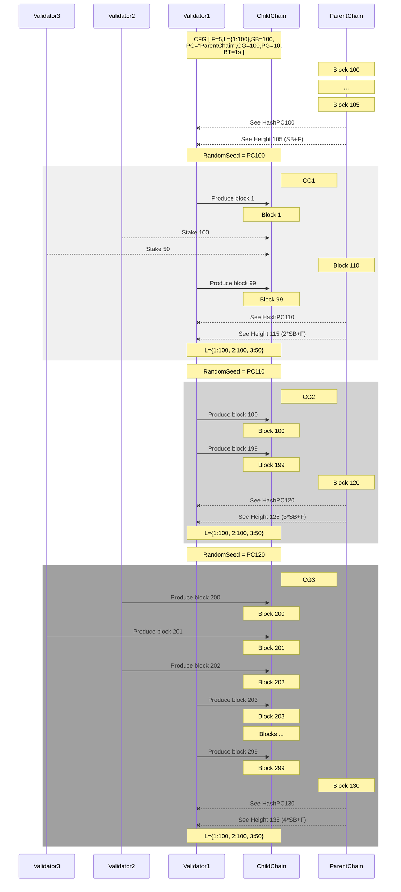

```mermaid
sequenceDiagram
    participant Validator3
    participant Validator2
    participant Validator1
    participant ChildChain
    participant ParentChain

    Note over Validator1,ChildChain: CFG [ F=5,L={1:100},SB=100,<br/>PC="ParentChain",CG=100,PG=10,<br/>BT=1s ]
    Note over ParentChain: Block 100
    Note over ParentChain: ...
    Note over ParentChain: Block 105
    ParentChain--xValidator1: See HashPC100
    ParentChain--xValidator1: See Height 105 (SB+F)
    Note over Validator1,ChildChain: RandomSeed = PC100

    rect rgb(240, 240, 240)
      note right of ChildChain: CG1
      Validator1->>+ChildChain: Produce block 1
      Note over ChildChain: Block 1
      Validator2-->>+ChildChain: Stake 100
      Validator3-->>+ChildChain: Stake 50
      Note over ParentChain: Block 110
      Validator1->>+ChildChain: Produce block 99
      Note over ChildChain: Block 99
      ParentChain--xValidator1: See HashPC110
      ParentChain--xValidator1: See Height 115 (2*SB+F)
      Note over Validator1,ChildChain: L={1:100, 2:100, 3:50}
    end

    Note over Validator1,ChildChain: RandomSeed = PC110
    rect rgb(210, 210, 210)
    note right of ChildChain: CG2
    Validator1->>+ChildChain: Produce block 100
    Note over ChildChain: Block 100
    Validator1->>+ChildChain: Produce block 199
    Note over ChildChain: Block 199
    Note over ParentChain: Block 120
    ParentChain--xValidator1: See HashPC120
    ParentChain--xValidator1: See Height 125 (3*SB+F)
    Note over Validator1,ChildChain: L={1:100, 2:100, 3:50}
    end
    Note over Validator1,ChildChain: RandomSeed = PC120
    rect rgb(160, 160, 160)
    note right of ChildChain: CG3
    Validator2->>+ChildChain: Produce block 200
    Note over ChildChain: Block 200
    Validator3->>+ChildChain: Produce block 201
    Note over ChildChain: Block 201
    Validator2->>+ChildChain: Produce block 202
    Note over ChildChain: Block 202
    Validator1->>+ChildChain: Produce block 203
    Note over ChildChain: Block 203
    Note over ChildChain: Blocks ...
    Validator1->>+ChildChain: Produce block 299
    Note over ChildChain: Block 299
    Note over ParentChain: Block 130
    ParentChain--xValidator1: See HashPC130
    ParentChain--xValidator1: See Height 135 (4*SB+F)
    Note over Validator1,ChildChain: L={1:100, 2:100, 3:50}
    end
```
