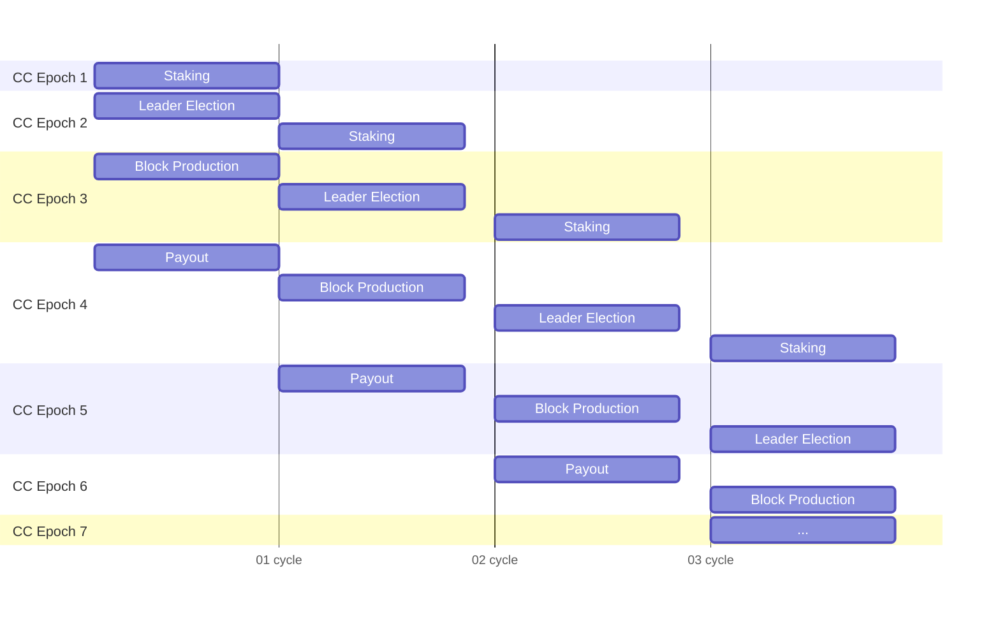

# Glossary

## Chains

### Child Chain (CC)
A proof of stake blockchain that is one half of a hyperchain.
The child chain is loosely connected to a parent chain.
That is, the parent chain has no knowledge of the child chain but the child chain is dependent on the parent chain.
The child chain uses the parent chain as a source of entropy and for "pinning".

### Parent Chain (PC)
Any blockchain that is "the other" half of a hyperchain.
The parent chain has no knowledge of the child chain.

## Blocks

### CC Block
Contains one keyblock and possibly one microblock.

### Keyblock
A placeholder block indicating the leader that should produce a microblock.

### Microblock
A block with transactions.

## Epochs

### Child Chain Epoch
Period of time represented in blocks during which validators are pre-selected to produce blocks and after which the state of the CC can be pinned to the PC.
the unqualified "Epoch" may be assuemd to refer to a child chain epoch.

### Parent Chain Epoch
The number of blocks on the parent chain that indicates which parent chain block will be used as the source of entropy for leader election.

### Staking Cycle
Contains 4 epochs: staking epoch, leader (s)election epoch, block production + pinning epoch, payout epoch. Represents minimum duration during which tokens are locked into staking contract.

## Actors

### Validator Pool
Validators eligible to become producers due to staking tokens

### Leader List
Producers chosen to act as leaders during an epoch

### Node Operators (Staked and non-staked validators)
All participants running a CC node are node operators.

### Leader
Producer chosen to produce the current block

### Pinner (Pinning Leader)
Block producer at the end of epoch that is allowed to collect a reward for pinning on the parent chain and posting the proof back on the child chain.

### Producers
Validator that produces a block.

### Delegator
Wallet/account that deposits tokens into staking contract on behalf of validator in order to increase the stake. Does not run a node or have further interaction with CC or PC.

## Actions & Events

### Stake
The amount of tokens deposited by delegators representing the selection weight of the validator to be chosen as a leader.

### Leader Election
The weighted random selection of leader from among eligible validators based on the amount to tokens staked in a staking contract.

### Block Production
The act of creation of a block done by the producer

### Block Reward
Tokens minted and/or transferred to staking contract to reward successful block production.

### Pinning Reward
Tokens minted and/or transferred to staking contract to reward successful pinning operation.
### Halting
A situation when no more blocks are produced (due to all stakers being inactive). This creates a problem for the HC creator to recover the HC and resume the block production. Some possible solutions are proposed.

### Termination
Willful end of a hyperchain

## On-Chain Protocol Components

### Staking Contract
Contract used by validator to represent the validator's stake, the ID and stake amount of delegators, and contains the functions for withdrawal of rewards.

### Leader Election Contract
Election rules defined at contract level (as opposed to consensus level). Likely not part of v1.0.

### Genesis Accounts
Accounts in which HC tokens are generated during the first block of CC.

